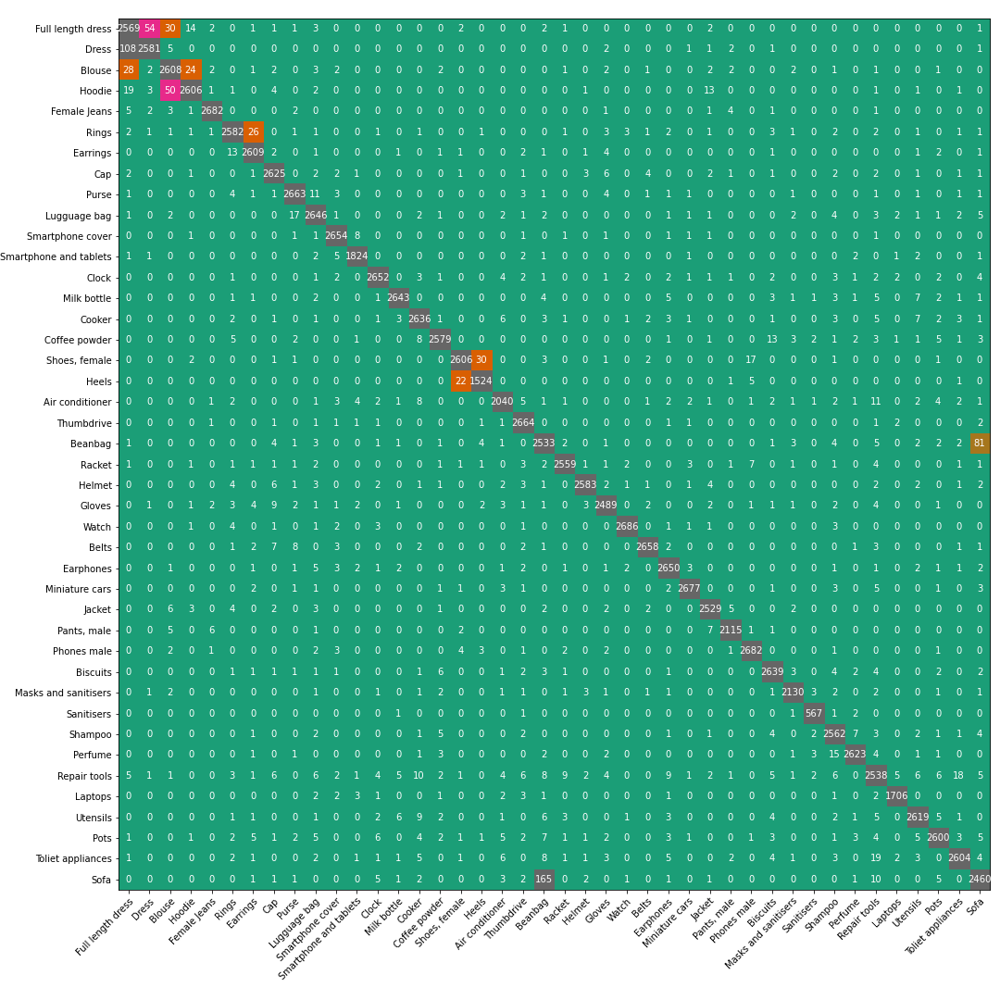

# 0. Abstract
In the Shopee Code League - Product Detection challenge, our team (Servants of the Joy) managed to obtain a private leaderboard score of [0.82648](https://www.kaggle.com/c/shopee-product-detection-student/leaderboard) (highest: 0.86804) and cliched the 33rd place in the student catgory (top 5%). 
This was accomplished without any external datasets and only using the limited computation accelerators (i.e. GPUs, TPUs) from Kaggle.
We used Tensorflow as the deep learning framework.
The architecture of our final model is a sequential model consisting of a pretrained DenseNet201, GlobalAveragePooling2D, and a dense layer with softmax activation. We fine tuned the pretrained DenseNet201 using 512x512x3 images, optmized using Adam, with 3 Fold cross validation.

# 1. Introduction
With the rise of e-commerce, people from all walks of live are embracing the process of buying and selling products online. Having a great variety of products is one of the key advantages of e-commerce sites as compared to brick and mortar stores. 

However, as the number of products listed on these sites increases, it inevitably leads to problems. One such problem is the categorization of the listed products. Due the sheer number of products, it is no longer feasible for products to be categorized solely by manual labour.

In the Product Detection challenge, participants are tasked to predict the correct categories of the products based on the images uploaded by users. 
We are given 105390 labeled and 12186 un-labeled images. 
Each labeled image is also given a integer value to denote its ground truth category, out of 42 categories.
However, much like in the real world sceanrio, these ground truth lables contain errors.
Furthermore, each class may not have the same number of labeled images.
Therefore, the real challenge is to build a classification model that is robust to these noises.

# 2. Data exploration

Except for these 6 categories: 11, 17, 18, 29, 33, 37, the distribution across the categories is quite uniform (Figure 1). Despite the presence of mis-labeled data, we are still able to get a rough sensing of what each category is about. For example, Figure 2 shows the images taken from category 5.

Figure 1:

Figure 2:

# 3. Data Processing
Since the number of data points is quite substantial, we decided to split the labelled data randomly into a 90/10 train-validation split. 
This split allocates 94860 data points into the training set and 10539 data points into the validation set. 
This split was used for models 01 to 08 (shown in results section).

For models 09 and 10, we used 3 Fold cross validation on the entire labelled data set instead.

# 4. Classification model
The final classificaiton model that we used was a simple sequential model .
We used a pretrained [DenseNet201](https://www.tensorflow.org/api_docs/python/tf/keras/applications/DenseNet201) as a base model, which was followed by a GlobalAveragePooling2D layer, and lastly a Dense layer with softmax activation. Note that by "simple", I am referring to the few lines of code that is needed to implement this model via Tensorflow's API.

## Results

| Index | Model Architecture | Image size | TL/FT  | Data Augmentation | Callbacks, Label smoothing, Optimizer, Extra feature           |  Validation acc. | 
| ----- | ------------------ | ---------- | -------| ----------------- | -------------------------------------------------------------- | ---------------- |
| 01    | MNetV2 + GAP + sm  | 160x160x3  |  TL    |   -               | MC,label smoothing=0, adam, 90/10 train-val split              | 0.62417          | 
| 02    | MNetV2 + GAP + sm  | 160x160x3  |  TL    |   -               | RLRoP+ES+MC,label smoothing=0, adam, 90/10 train-val split     | 0.66719          | 
| 04    | XNet + GAP + sm    | 512x512x3  |  FT    |   -               | LRS+ES+MC, label smoothing=0, adam, 90/10 train-val split      | 0.79044          |
| 05    | XNet + GAP + sm    | 512x512x3  |  FT    |   DA method 1     | LRS+ES+MC, label smoothing=0, adam, 90/10 train-val split      | 0.80258          |
| 06    | DNet201 + GAP + sm | 512x512x3  |  FT    | Flips+GridMask    | LRoP+ES+MC, label smoothing=0.1, adam,90/10 train-val split    | 0.82607          |
| 07    | DNet201 + GAP + sm | 512x512x3  |  FT    | Flips+GridMask    | LRS+ES+MC, label smoothing=0.1, adam, 90/10 train-val split    | 0.81604          |
| 08    | DNet201 + GAP + sm | 512x512x3  |  FT    | Flips+GridMask    | LRS+ES+MC, label smoothing=0.2, adam, 90/10 train-val split    | 0.80390          |
| 09    | XNet + GAP + sm    | 512x512x3  |  FT    |   DA method 1     | LRS+ES+MC, label smoothing=0, adam, 3Fold CV, all labeled data | 0.82026          |
| 10    | DNet201 + GAP + sm | 512x512x3  |  FT    |   DA method 1     | LRS+ES+MC, label smoothing=0, adam, 3Fold CV, all labeled data | 0.82581          |

Legend
- TL: Transfer learning
- FT: Fine tuning
- XNet: Xception model
- MNetV2: MobileNetV2 model
- DNet201: DenseNet201 model
- GAP: GlobalAveragePooling2D layer
- sm: softmax layer
- DA method 1: Data augmentation method mentioned [here](https://www.kaggle.com/cdeotte/rotation-augmentation-gpu-tpu-0-96)
- RLRoP: ReduceLROnPlateau callback
- ES: Earlystopping callback
- MC: ModelCheckpoint callback
- LRS: Learning rate scheduler callback mentioned [here](https://www.kaggle.com/mgornergoogle/getting-started-with-100-flowers-on-tpu)

# 5. Post competition review

The key element to achieve a high accuracy (around 0.80) for this task was to train our model with Google's Tensor Processing Units (TPUs). The reduction in training time was significant and this allowed us to try more complex pretrained models i.e. DenseNet201 and various data augmentation techniques.

Using the predictions of our model, we obtained the confusion matrix on the training data (Figure 3). 
The labels on the horizontal and vertical axis are our assumed category name for each of the 42 classes. We noticed that there were groups of classes that are more prone to be mislabelled with a label within the group. 
For example, data points in classes 0, 1, and 2 are more prone to be mislabelled with labels from the other 2 classes in this group. 
Also, despite some classes having much lesss data points to train on, many of them still had really high accuracies. 
A more worrying discovery was that the model gave high probability for its prediction even though the image was clearly incorrectly labelled, along wih the high training accuracy of > 0.99, suggests that the model was already overfitting the images. 
Therefore, we decided to focus more on the OCR results and other features to make our models more robust.

Figure 3:

## Things that helped:
1. TPU >> GPU >> CPU.
2. More complex model such as DNet/XNet compared to MNetV2. Training acc was able to increase from ~0.7 to >0.99. Although, difficult to say DNet or XNet is better.
3. FT >> TL.
4. Data agumentation. Although, difficult to say kind of DA is better.
5. KFold CV helps slightly.

# 6. Reference

## Kaggle notebooks:
1. [Getting started with 100+ flowers on TPU](https://www.kaggle.com/mgornergoogle/getting-started-with-100-flowers-on-tpu): Basic template for using TPU on classification problem with data augmentation: random flip left right.
2. [Rotation Augmentation GPU/TPU - [0.96+]](https://www.kaggle.com/cdeotte/rotation-augmentation-gpu-tpu-0-96): Using TPU on classification problem with data augmentation: random rotation, shearing, zoom, and shift, flip left right.
3. [Cutmix vs Mixup vs Gridmask vs Cutout](https://www.kaggle.com/saife245/cutmix-vs-mixup-vs-gridmask-vs-cutout): Code for data augmentation: Cutmix, Mixup, Gridmask, Cutout
4. [Test Time Augmentation (TTA) ... worth it?](https://www.kaggle.com/andrewkh/test-time-augmentation-tta-worth-it)

## Online articles:
1. [TFRecord and tf.Example](https://www.tensorflow.org/tutorials/load_data/tfrecord): Tensorflow's official tutorial on TFRecords.
2. [Tensorflow Records? What they are and how to use them](https://medium.com/mostly-ai/tensorflow-records-what-they-are-and-how-to-use-them-c46bc4bbb564): In-depth explanation on writing/reading TFRecords.
3. [A Conceptual Explanation of Bayesian Hyperparameter Optimization for Machine Learning](https://towardsdatascience.com/a-conceptual-explanation-of-bayesian-model-based-hyperparameter-optimization-for-machine-learning-b8172278050f): Provides theoretical explanation for how Bayesian optimization works.
4. [Introduction: Bayesian Optimization using Hyperopt](https://github.com/WillKoehrsen/hyperparameter-optimization/blob/master/Introduction%20to%20Bayesian%20Optimization%20with%20Hyperopt.ipynb): A simple demonstration of Bayesian optimzation.
5. [Tf-idf weighting](https://nlp.stanford.edu/IR-book/html/htmledition/tf-idf-weighting-1.html): Exaplanation for Term frequency - inverse document frequency.
6. [Stacking Ensemble Machine Learning With Python](https://machinelearningmastery.com/stacking-ensemble-machine-learning-with-python/)
7. 

## Academic papers:
1. [Xception: Deep Learning with Depthwise Separable Convolutions](https://arxiv.org/abs/1610.02357).
2. [GridMask Data Augmentation](https://arxiv.org/abs/2001.04086).
3. [CutMix: Regularization Strategy to Train Strong Classifiers with Localizable Features](https://arxiv.org/abs/1905.04899).
4. [mixup: Beyond Empirical Risk Minimization](https://arxiv.org/abs/1905.04899).
5. [Improved Regularization of Convolutional Neural Networks with Cutout](https://arxiv.org/abs/1708.04552.pdf).
6. [Data Augmentation using Random Image Cropping and Patching for Deep CNNs](https://arxiv.org/abs/1811.09030).
7. [Densely Connected Convolutional Networks](https://arxiv.org/abs/1608.06993)

