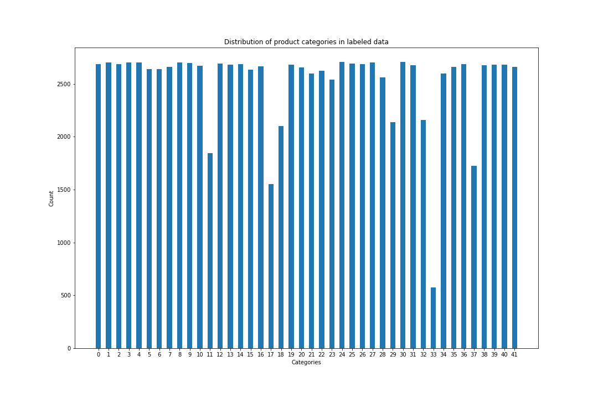

# 1. Introduction
With the rise of e-commerce, people from all walks of live are embracing the process of buying and selling products online. Having a great variety of products is one of the key advantages of e-commerce sites as compared to brick and mortar stores. 

However, as the number of products listed on these sites increases, it inevitably leads to problems. One such problem is the categorization of the listed products. Due the sheer number of products, it is no longer feasible for products to be manually categorized.
Without cost-effective and accurate categorization of the products, it may become cumbersome for potential buyers to find the product that they want. Also, an indirect effect of this problem may be a reduction in the relevance of recommended products because the recommendation systems are given inaccurate product category.

Overall, this will lead to a decrease in user experience, which in turn will adversely impact the conversion rate of the e-commerce site. Therefore, it is vital for e-commerce sites, such as Shopee, to have an effective product categorizaion algorithm.

In the "Product Detection" challenge, participants are tasked to predict the correct categories of the products based on the images uploaded by users. 
We are given 105390 labeled and 12186 un-labeled images. 
Each labeled image is also given a integer value to denote its ground truth category, out of 42 categories.
However, much like in the real world sceanrio, these ground truth lables contain errors.
Furthermore, each class may not have the same number of labeled images.
Therefore, the real challenge is to build a classification model that is robust to these noises.

# 2. Preliminary data analysis

Except for these 6 categories: 11, 17, 18, 29, 33, 37, the distribution across the categories is quite uniform (Figure 1). Despite the presence of mis-labeled data, we are still able to get a rough sensing of what each category is about. For example, Figure 2 shows the images taken from category 5.

Figure 1:

Figure2:

Is there any relationship between category and original image length?

## Results

| Index | Model Architecture | Image size | TL/FT  | Data Augmentation | Callbacks, Label smoothing, Optimizer, Extra feature           |  PS     | Notebook |
| ----- | ------------------ | ---------- | -------| ----------------- | -------------------------------------------------------------- | ------- | -------- |
| 01    | MNetV2 + GAP + sm  | 160x160x3  |  TL    |   -               | MC,label smoothing=0, adam, 90/10 train-val split              | 0.62417 | -        |
| 02    | MNetV2 + GAP + sm  | 160x160x3  |  TL    |   -               | RLRoP+ES+MC,label smoothing=0, adam, 90/10 train-val split     | 0.66719 | -        |
| 03    | XNet + GAP + sm    | 160x160x3  |  FT    |   -               | LRS+ES+MC, label smoothing=0, adam, 90/10 train-val split      |    ?    | -        |
| 04    | XNet + GAP + sm    | 512x512x3  |  FT    |   -               | LRS+ES+MC, label smoothing=0, adam, 90/10 train-val split      | 0.79044 | -        |
| 05    | XNet + GAP + sm    | 512x512x3  |  FT    |   DA method 1     | LRS+ES+MC, label smoothing=0, adam, 90/10 train-val split      | 0.80258 | -        |
| 06    | XNet + GAP + sm    | 512x512x3  |  FT    |   DA method 1     | LRS+ES+MC, label smoothing=0, adam, 3Fold CV, all labeled data | 0.82026 | -        |
| 07    | DNet201 + GAP + sm | 512x512x3  |  FT    |   DA method 1     | LRS+ES+MC, label smoothing=0, adam, 3Fold CV, all labeled data | 0.82581 | -        |
| 08    | DNet201 + GAP + sm | 512x512x3  |  FT    | Flips+GridMask    | LRoP+ES+MC, label smoothing=0.1, adam,90/10 train-val split    | 0.82607 | -        |
| 09    | DNet201 + GAP + sm | 512x512x3  |  FT    | Flips+GridMask    | LRS+ES+MC, label smoothing=0.1, adam, 90/10 train-val split    | 0.81604 | -        |
| 10    | DNet201 + GAP + sm | 512x512x3  |  FT    | Flips+GridMask    | LRS+ES+MC, label smoothing=0.2, adam, 90/10 train-val split    | 0.80390 | -        |

Legend
- TL: Transfer learning
- FT: Fine tuning
- XNet: Xception model
- MNetV2: MobileNetV2 model
- DNet201: DenseNet201 model
- GAP: GlobalAveragePooling2D layer
- sm: softmax layer
- DA method 1: Data augmentation method mentioned [here](https://www.kaggle.com/cdeotte/rotation-augmentation-gpu-tpu-0-96)
- RLRoP: ReduceLROnPlateau callback
- ES: Earlystopping callback
- MC: ModelCheckpoint callback
- LRS: Learning rate scheduler callback mentioned [here](https://www.kaggle.com/mgornergoogle/getting-started-with-100-flowers-on-tpu)
- PS: Public Score

## Things that helped:
1. TPU >> GPU >> CPU.
2. More complex model such as DNet/XNet compared to MNetV2. Training acc was able to increase from ~0.7 to >0.99. Although, difficult to say DNet or XNet is better.
3. FT >> TL.
4. Data agumentation. Although, difficult to say kind of DA is better.
5. KFold CV helps slightly.

## Things that does not seem to help:
1. Label smoothing.

## Things that could help.
1. Adding new features such as original image size and OCR.
2. Use 1024 * 1024 images but each epoch will take 30mins.
3. [Data Augmentation using Random Image Cropping and Patching for Deep CNNs](https://arxiv.org/abs/1811.09030).
4. Add `tf.keras.layers.Dropout(0.1)` to reduce overfitting.
5. Add zoom into augmentation for categories that consists of small objects.
6. Differentiatal evolution
7. Hill climbing algorithm.
8. Stacking.
9. Use 100% labeled data to train model.
10. Try other model architecture e.g. inception_resnet_v2, inception_v3, nasnet, efficientnet but I'm reluctant to try this because the current models are already overfitting the training data (>0.99 acc).
11. Focal loss. Focus on loss for categories that are more difficult to classify.
12. SGD

## Experiments to do:
1. Compare different data augmentation methods
2. Compare between using 1024 * 1024 images with 512 * 512 images.

## Things to note:
1. Validation set seems to resemble closely to test set. Calidation accuracy is usually within +0.02 of public score.

## Reference Kaggle notebooks:
1. [Getting started with 100+ flowers on TPU](https://www.kaggle.com/mgornergoogle/getting-started-with-100-flowers-on-tpu): Basic template for using TPU on classification problem with data augmentation: random flip left right.
2. [Rotation Augmentation GPU/TPU - [0.96+]](https://www.kaggle.com/cdeotte/rotation-augmentation-gpu-tpu-0-96): Using TPU on classification problem with data augmentation: random rotation, shearing, zoom, and shift, flip left right.
3. [Cutmix vs Mixup vs Gridmask vs Cutout](https://www.kaggle.com/saife245/cutmix-vs-mixup-vs-gridmask-vs-cutout): Code for data augmentation: Cutmix, Mixup, Gridmask, Cutout

## Reference online articles:
1. [TFRecord and tf.Example](https://www.tensorflow.org/tutorials/load_data/tfrecord): Tensorflow's official tutorial on TFRecords.
2. [Tensorflow Records? What they are and how to use them](https://medium.com/mostly-ai/tensorflow-records-what-they-are-and-how-to-use-them-c46bc4bbb564): In-depth explanation on writing/reading TFRecords.

## Reference papers:
1. [Xception: Deep Learning with Depthwise Separable Convolutions](https://arxiv.org/abs/1610.02357).
2. [GridMask Data Augmentation](https://arxiv.org/abs/2001.04086).
3. [CutMix: Regularization Strategy to Train Strong Classifiers with Localizable Features](https://arxiv.org/abs/1905.04899).
4. [mixup: Beyond Empirical Risk Minimization](https://arxiv.org/abs/1905.04899).
5. [Improved Regularization of Convolutional Neural Networks with Cutout](https://arxiv.org/abs/1708.04552.pdf).
6. [Data Augmentation using Random Image Cropping and Patching for Deep CNNs](https://arxiv.org/abs/1811.09030).
7. [Densely Connected Convolutional Networks](https://arxiv.org/abs/1608.06993)

